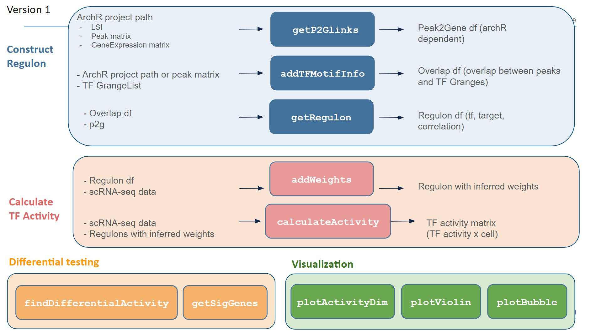

# Epiregulon

Gene regulatory networks model the underlying gene regulation hierarchies that drive gene expression and
observed phenotypes. The main function of the epiregulon R package is to infer TF activity in single cells by
constructing a gene regulatory network (regulons). This is achieved through integration of scATAC-seq and
scRNA-seq data and incorporation of public bulk TF ChIP-seq data. Links between regulatory elements
and their target genes are established by computing correlations between chromatin accessibility and gene
expressions.

Current prerequisite for running epiregulon is a ArchR project with pre-computed peak and gene matrices.
It is also expected that LSI dimensionality reduction and integration with an scRNA-seq dataset has been
performed. The scATAC-seq experiment can be either paired or unpaired with the scRNA-seq dataset as
long as they were already integrated by ArchR. The final output of epiregulon is a matrix of TF activities
where rows are individual TFs and columns are single cell indexes.

