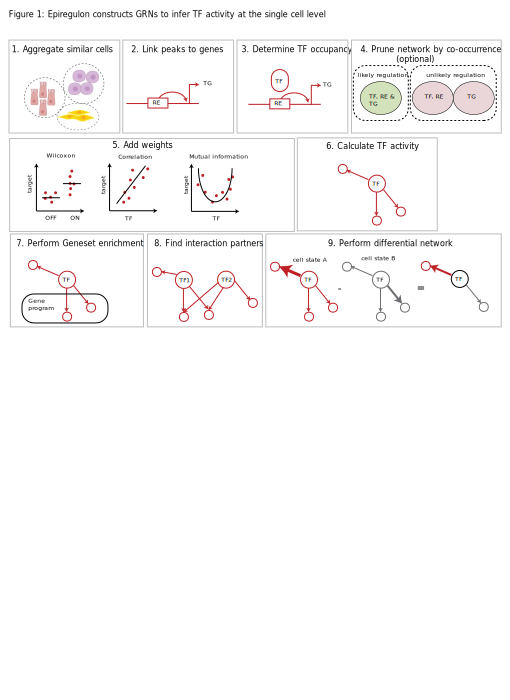
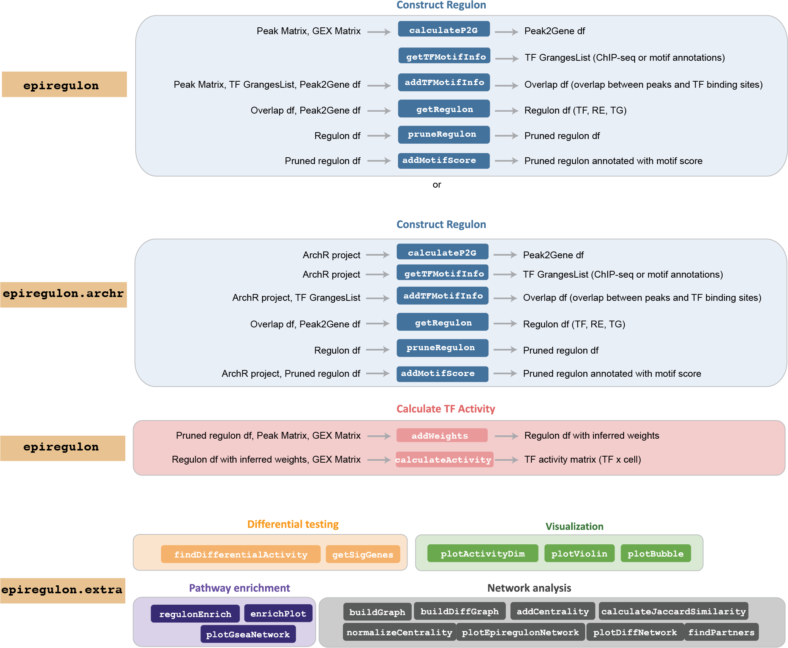

<br>

# Introduction

Gene regulatory networks model the underlying gene regulation hierarchies that drive gene expression and cell states. The main function of the epiregulon package is to construct gene regulatory networks and infer transcription factor (TF) activity in single cells by integration of scATAC-seq and scRNA-seq data and incorporation of public bulk TF ChIP-seq data.

For full documentation, please refer to the epiregulon [book](https://xiaosaiyao.github.io/epiregulon.book/).

Preprint
Epiregulon: Inference of single-cell transcription factor activity to dissect mechanisms of lineage plasticity and drug response
Tomasz Włodarczyk, Aaron Lun, Diana Wu, Shreya Menon, Shushan Toneyan, Kerstin Seidel, Liang Wang, Jenille Tan, Shang-Yang Chen, Timothy Keyes, Aleksander Chlebowski, Yu Guo, Ciara Metcalfe, Marc Hafner, Christian W. Siebel, M. Ryan Corces, Robert Yauch, Shiqi Xie, Xiaosai Yao
bioRxiv 2023.11.27.568955; doi: [https://doi.org/10.1101/2023.11.27.568955](https://www.biorxiv.org/content/10.1101/2023.11.27.568955v1)

 
There are three related packages. The core epiregulon package supports `SingleCellExperiment` objects. If the users would like to start from `ArchR` projects, they may choose to use `epiregulon.archr` package, which allows for the seamless integration with the [ArchR](https://www.archrproject.com/) package. Moreover, we provide a suite of tools in `epiregulon.extra` package for the enrichment analysis, visualization, and network analysis which can be run on the `epireglon` or `epiregulon.archr` output.

# Installation

```
if(!require(BiocManager)) install.packages("BiocManager")
BiocManager::install("epiregulon")
```

# System Requirements

## Hardware Requirements

The epiregulon package has been tested on a standard MacBook with 16GB of RAM and 8 cores

## Software Requirements

The epiregulon package is supported for macOS, Linux and Windows. The package has been tested on the following systems:

- macOS: Monterey (12.7.1)
- Linux: Ubuntu 22.04.2 LTS
- Windows: Windows 2022

Users should have R version 4.3.0 or higher

# Functions
Functions in the suite of Epiregulon packages


Contact: [Xiaosai Yao](mailto:yao.xiaosai@gene.com), Genentech Inc.

